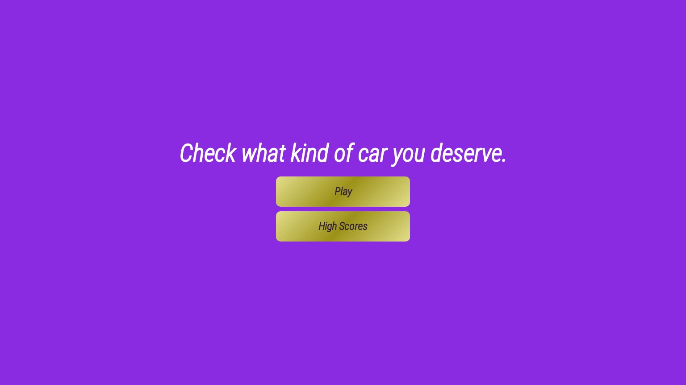

<h1 align="center">Quiz</h1>
[View the live project here.](https://rustam-aliyev889.github.io/Quiz/index.html)
<h2 align="center"></h2>

# What the Project is about? 
The project is a car related quiz. It consists of 13 questions and 4 answers for each question.You have 15 seconds for each question. The goal of the quiz is to test your knowledge about cars in addition to find out waht car you should be driving.  :-)

Altogether there are 4 web pages.

-   ## User stories

    -   ### First Time Visitor Goals

        1. As a First Time Visitor, I want to be able to understand how the website works. 
        2. As a First Time Visitor, I want to be able to understand what is the purpose of the website.
        3. As a First Time Visitor, I want to be able to understand main rules. 
    
     

     

    -   ### Returning Visitor Goals

        1. As a Returning Visitor, I want them to be able to save their score.
        2. As a Returning Visitor, I want them to be able to compare their score with other players. 
   
     

     

    -   ### Frequent User Goals
        1. As a Frequent User, I want them to enjoy the website. 
        2. As a Frequent User, I want them to encourage others to improve their knowledge about cars. 

# Web pages
### Main(Index.html) page
The Main page is the landing page which gives you two options. You can either start the quiz or check the highscores.
### Quiz page
Self-explanatory.
### End page
The End page shows you your final score and a car you deserve. It also gives you the opportunity to save your score, play the quiz again or go to the main page.
### High Score 
This page display leaderboard(both scores and the names of the players). You can go to the main page form it as well.

# Wireframes 

  

-   PC Wireframe- [View](https://github.com/Rustam-Aliyev889/Quiz/blob/main/static/images/wireframes/quiz_pc.png)
-   Tablet Wireframe - [View](https://github.com/Rustam-Aliyev889/Quiz/blob/main/static/images/wireframes/quiz_tablet.png)
-   Phone Wireframe - [View](https://github.com/Rustam-Aliyev889/Quiz/blob/main/static/images/wireframes/quiz_phone.png) 

# Technologies, Frameworks, Libraries & Programs Used 

-   [HTML5](https://en.wikipedia.org/wiki/HTML5)
-   [CSS3](https://en.wikipedia.org/wiki/Cascading_Style_Sheets)
-   [Javascript](https://en.wikipedia.org/wiki/javascript)
- [Google Fonts:](https://fonts.google.com/)     
    - Google fonts were used to import the 'Roboto' font into the style.css file which is used on all pages throughout the project.
- [Git](https://git-scm.com/)
    - Git was used for version control by utilizing the VS Code terminal to commit to Git and Push to GitHub.
- [Visual Studio Code](https://code.visualstudio.com)
    - I used VS Code as I have found it quite easy to use and also enables me to automatically have a hard copy of each file on my laptop
- [GitHub:](https://github.com/)
    - GitHub is used to store the projects code after being pushed from Git.
- [Balsamiq:](https://balsamiq.com/)
    - Balsamiq was used to create the wireframes during the design process.

# Testing
## Testing web page links
|Test Case| Test|Expected Outcome|Actual Outcome|Comment|
| ------ | ------ |------ |------ |------ |
|1|   Main page links  functional test    |  launch Main page        |All links launched Main page|n/a|
|2|  Quiz  links functional test     | launch Quiz page          |all links launched Quiz page|n/a|
|3|  End links funtional test for all pages    |   launch End page        |All links launched |n/a|
|4| HighScores links functional tests for all pages     | launch HighScores page          |All links launched correctly|n/a|

## Browser support testing
The following web browsers were used to test the display of the website including the functionality of the contact us form:
###### Edge
###### Chrome
###### Opera
###### Safari

## Language validation
The W3C Markup Validator, W3C CSS Validator and JShint Services were used to validate every page of the project to ensure there were no syntax errors in the project. 

  

-   [W3C Markup Validator](https://validator.w3.org/nu/?doc=https%3A%2F%2Frustam-aliyev889.github.io%2FQuiz%2Findex.html) - Results - No Errors or Warnings

 

-   [W3C CSS Validator](https://jigsaw.w3.org/css-validator/validator) - Results No Errors 

-   [Lighthouse reports]:

  

-   [JShint report]: - Results No Errors 

  

# Bugs
## To test my code I isolated some parts of it with comments to find out what is might be the problem. I ran into a couple of problems however isolation helped me to figure it out. I also used additional software to see how my functions behave here are some examples: 

  

  

  

|Bug|Comment|
| ------ | ------ |
|Pages were not linked correctly as they were linking to the wrong pages or didn't work at all|This was corrected and recorded in the Test log|
|The timer didn't start again eaach time you go to a new question |Code was included to correct it. Subsequent test verified correct operation of the timer|
|Final result wasn't given at the end of the quiz|This was fixed and tested to ensure it works| 

## Deployment

### Where can it be found on GitHub? 
The GitHub link for the project is - https://github.com/Rustam-Aliyev889/Quiz

### GitHub Pages

I deployed the project onto GitHub Pages using the following steps:

1. Go to my GitHub repository for the project this is the link. [My GitHub Repository for Quiz](https://github.com/Rustam-Aliyev889/Quiz)
2. Locate the 'Settings' button for the repository and click.
3. Scroll down the Settings page until you see the "Pages" Section on your left.
4. You need to change the "Source", by clicking the dropdown and choose "deploy from a branch".
5. You then need to change branch from 'None' to 'main'.
7. The page will automatically refresh.
7. At the top of the 'Pages' section, look to locate the now published site [link](https://rustam-aliyev889.github.io/Quiz/index.html).

## Contributing

Pull requests are welcome. For major changes, please open an issue first
to discuss what you would like to change.

Please make sure to update tests as appropriate.

